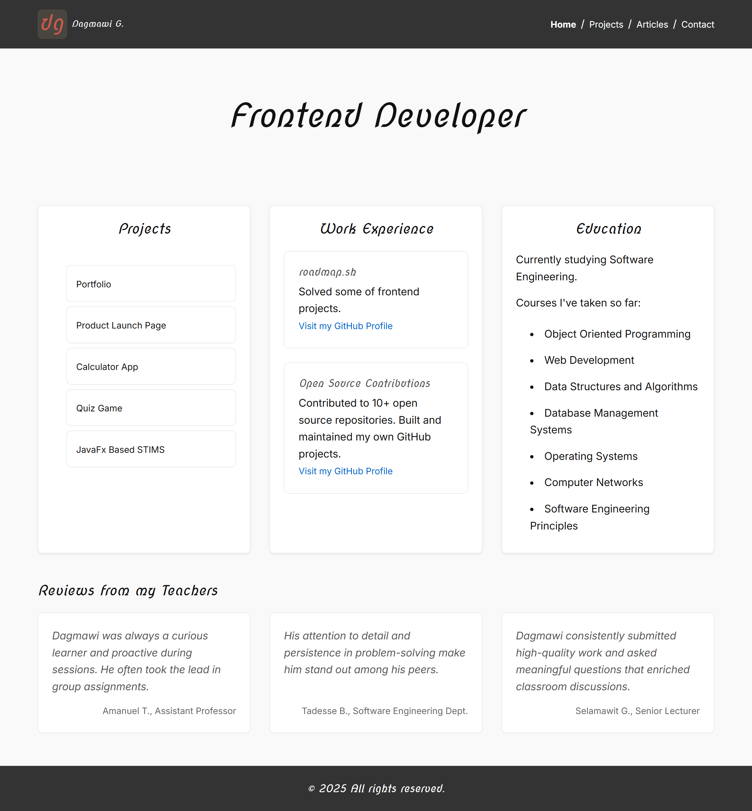

# Personal Portfolio

## ✨ Features

* **Modern, accessible, and semantic HTML structure**
* **Fully responsive layout** across all devices using CSS Grid and media queries
* **Thematic design system** with CSS variables for color, typography, spacing, and layout
* **Interactive navigation** with hover effects and active state styling
* **Modular sections** including Projects, Experience, Education, and Reviews
* **Optimized for SEO and social media** with meta tags for Open Graph and Twitter cards
* **Typography powered by Google Fonts**: Nova Script for headings, Inter for body text
* **Dark-on-light theme** with clearly defined accent color for brand identity
* **Print styles and reduced motion preferences** for accessibility and usability
* **Scalable project/portfolio structure** for adding new pages (Articles, Contact, etc.)

