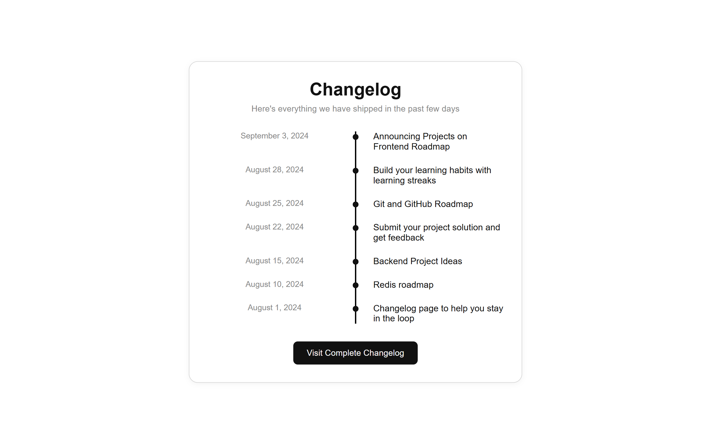

# Changelog Component

## ✨ Features

* **Semantic HTML5 structure** for meaningful markup and better accessibility
* **CSS timeline layout** to visually represent updates chronologically
* **Fully responsive design** with mobile-friendly adjustments using media queries
* **Clean, centered UI layout** using Flexbox and max-width constraints
* **Subtle UI polish** with shadows, spacing, and hover states
* **Accessible button** for navigating to full changelog

