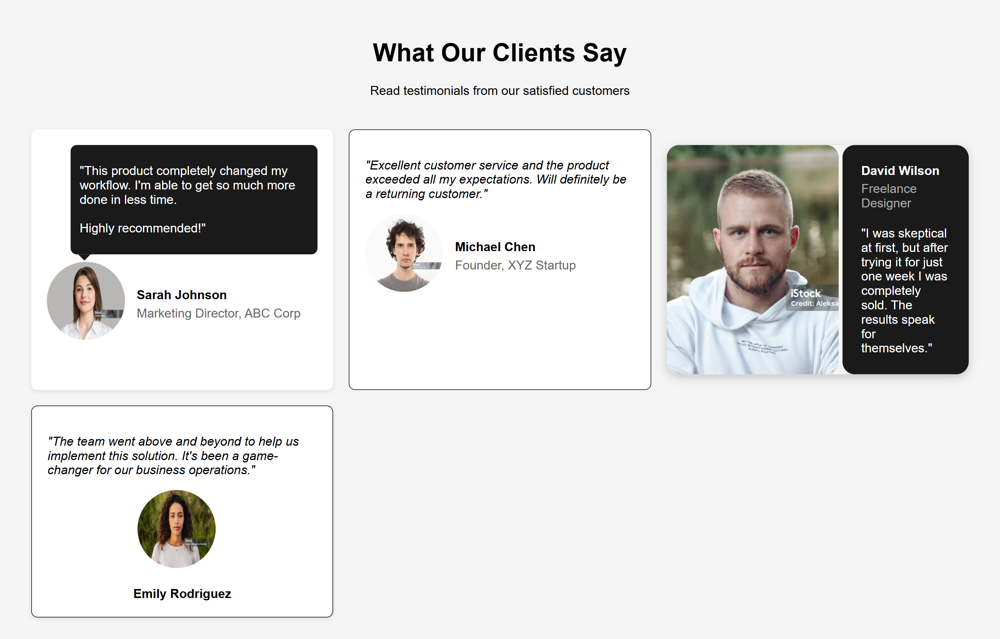

# Testimonial Cards

## ✨ Features

* **Responsive grid layout** using CSS Grid with auto-fill and minmax for adaptability
* **Four unique testimonial card designs** showcasing varied visual styles and structures
* **Speech bubble styling** with custom arrow pointer for conversational tone
* **Clean, modern card aesthetics** using shadows, rounded corners, and padding
* **Image-based author profiles** with circular avatar presentation
* **Mobile-first responsive behavior** for seamless experience across devices

 