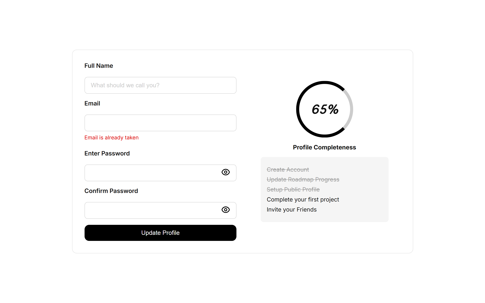

# Accessible Form UI

## ✨ Features

* **Accessible and semantic form** using proper labels, `aria` attributes, and live region messaging
* **Password fields with toggle visibility** via interactive eye icon buttons
* **Responsive two-column layout** with mobile-first adaptation using CSS Grid
* **Live error feedback** with `aria-live="polite"` for screen reader compatibility
* **Profile completeness section** with circular progress indicator and dynamic checklist
* **Modern font pairing** using Google Fonts (`Inter` for body, `Nova Script` for headings) for improved readability and style

