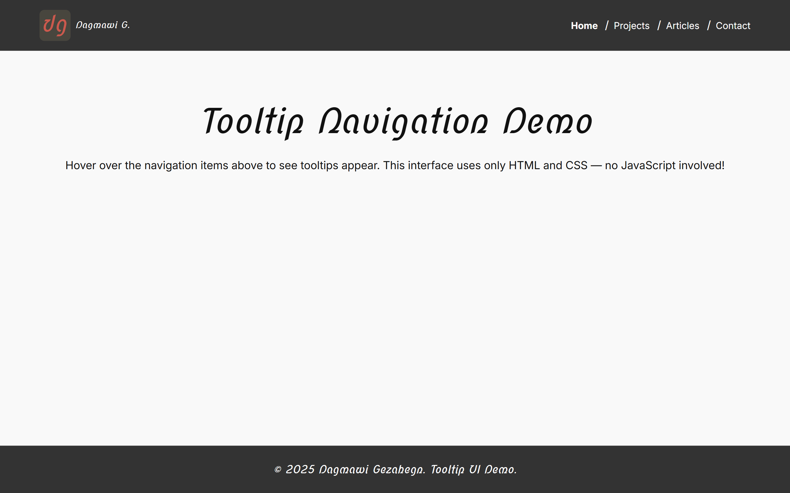

# Tooltip UI

## ✨ Features

* **Fully responsive layout** with CSS Grid and Flexbox for adaptive design across desktop, tablet, and mobile devices
* **Sticky header with logo and navigation** that stays accessible and readable while scrolling
* **Interactive navigation menu** with dynamic hover underlines and keyboard focus support
* **Custom tooltips** with smooth animations, arrow indicators, and screen-edge awareness for better usability
* **Theming with CSS variables** for colors, spacing, typography, and layout control from a single source of truth
* **Modern font pairing** using Google Fonts (`Inter` for body, `Nova Script` for headings) for a clean and stylish look
* **Accessible semantics** with keyboard navigability and high contrast for better user experience

