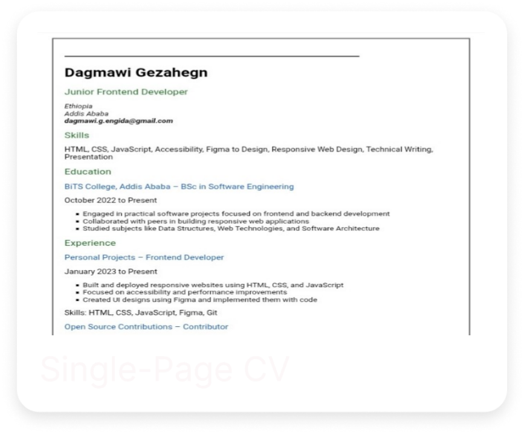

# Frontend Projects from Roadmap.sh

This repository contains front-end projects built by following the [roadmap.sh](https://roadmap.sh/) Frontend Developer path.

---

## 📁 Projects List
- [Single Page CV](https://roadmap.sh/projects/single-page-cv)
- [Basic HTML Website](https://roadmap.sh/projects/basic-html-website)
- [Personal Portfolio](https://roadmap.sh/projects/portfolio-website)
- [Changelog Component](https://roadmap.sh/projects/changelog-component)
- [Testimonial Cards](https://roadmap.sh/projects/testimonial-cards)
- [Datepicker UI](https://roadmap.sh/projects/datepicker-ui)
- [Accessible Form UI](https://roadmap.sh/projects/accessible-form-ui)

Click the image below to view the project’s README and explore the demo:

  

  

  

  

  

  

  

  

  

  